# Katıl Butonu - Mimari Diyagram

## 🏗️ Sistem Mimarisi

### Mevcut Durum (Sorunlu)

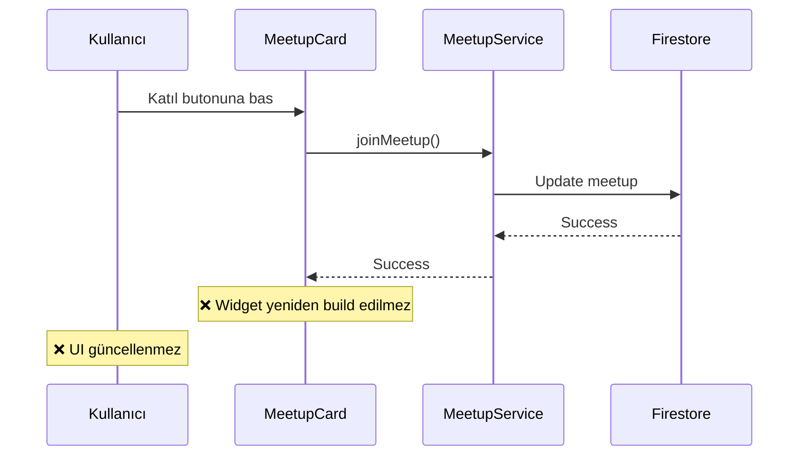
```mermaid
sequenceDiagram
    participant U as Kullanıcı
    participant MC as MeetupCard
    participant MS as MeetupService
    participant FS as Firestore
    
    U->>MC: Katıl butonuna bas
    MC->>MS: joinMeetup()
    MS->>FS: Update meetup
    FS-->>MS: Success
    MS-->>MC: Success
    Note over MC: ❌ Widget yeniden build edilmez
    Note over U: ❌ UI güncellenmez
```

### Yeni Durum (Çözüm)

#### Liste Sayfası - Optimistic Update

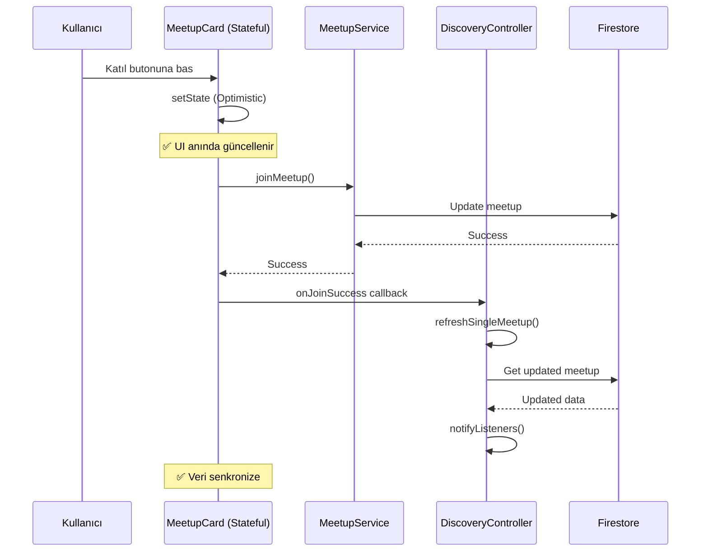
```mermaid
sequenceDiagram
    participant U as Kullanıcı
    participant MC as MeetupCard (Stateful)
    participant MS as MeetupService
    participant DC as DiscoveryController
    participant FS as Firestore
    
    U->>MC: Katıl butonuna bas
    MC->>MC: setState (Optimistic)
    Note over MC: ✅ UI anında güncellenir
    MC->>MS: joinMeetup()
    MS->>FS: Update meetup
    FS-->>MS: Success
    MS-->>MC: Success
    MC->>DC: onJoinSuccess callback
    DC->>DC: refreshSingleMeetup()
    DC->>FS: Get updated meetup
    FS-->>DC: Updated data
    DC->>DC: notifyListeners()
    Note over MC: ✅ Veri senkronize
```

#### Detay Sayfası - StreamBuilder

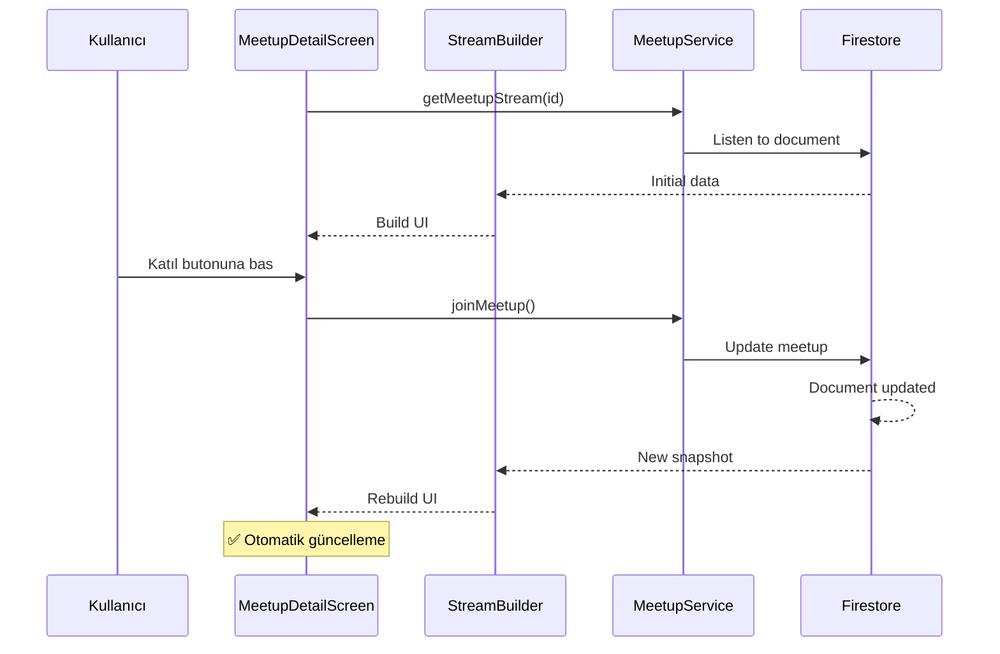
```mermaid
sequenceDiagram
    participant U as Kullanıcı
    participant MDS as MeetupDetailScreen
    participant SB as StreamBuilder
    participant MS as MeetupService
    participant FS as Firestore
    
    MDS->>MS: getMeetupStream(id)
    MS->>FS: Listen to document
    FS-->>SB: Initial data
    SB-->>MDS: Build UI
    
    U->>MDS: Katıl butonuna bas
    MDS->>MS: joinMeetup()
    MS->>FS: Update meetup
    FS-->>FS: Document updated
    FS-->>SB: New snapshot
    SB-->>MDS: Rebuild UI
    Note over MDS: ✅ Otomatik güncelleme
```

## 🔄 Veri Akış Diyagramı

### Genel Akış

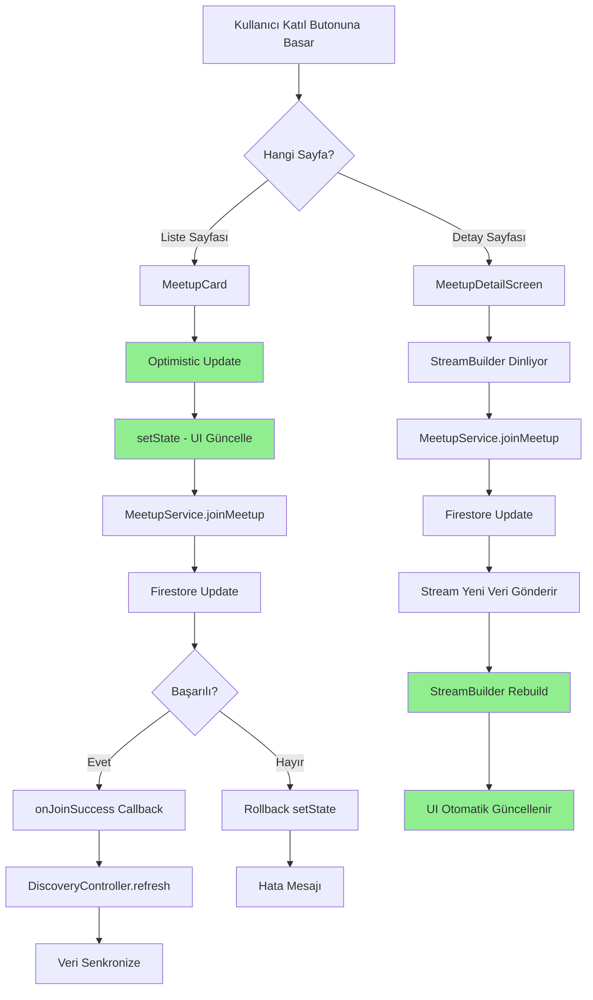
```mermaid
flowchart TD
    A[Kullanıcı Katıl Butonuna Basar] --> B{Hangi Sayfa?}
    
    B -->|Liste Sayfası| C[MeetupCard]
    B -->|Detay Sayfası| D[MeetupDetailScreen]
    
    C --> E[Optimistic Update]
    E --> F[setState - UI Güncelle]
    F --> G[MeetupService.joinMeetup]
    G --> H[Firestore Update]
    H --> I{Başarılı?}
    I -->|Evet| J[onJoinSuccess Callback]
    I -->|Hayır| K[Rollback setState]
    J --> L[DiscoveryController.refresh]
    L --> M[Veri Senkronize]
    K --> N[Hata Mesajı]
    
    D --> O[StreamBuilder Dinliyor]
    O --> P[MeetupService.joinMeetup]
    P --> Q[Firestore Update]
    Q --> R[Stream Yeni Veri Gönderir]
    R --> S[StreamBuilder Rebuild]
    S --> T[UI Otomatik Güncellenir]
    
    style E fill:#90EE90
    style F fill:#90EE90
    style S fill:#90EE90
    style T fill:#90EE90
```

## 🎨 Widget Ağacı

### Liste Sayfası (DiscoveryPage)

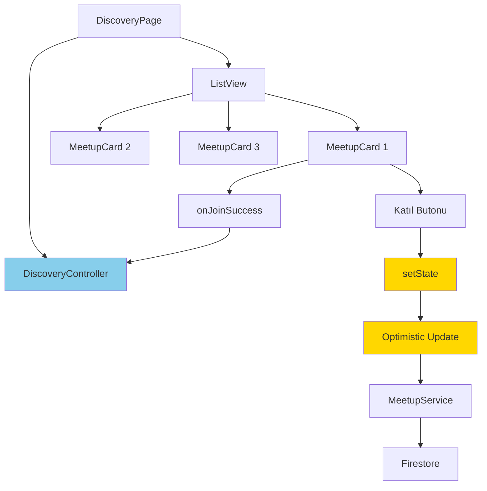
```mermaid
graph TD
    A[DiscoveryPage] --> B[DiscoveryController]
    A --> C[ListView]
    C --> D1[MeetupCard 1]
    C --> D2[MeetupCard 2]
    C --> D3[MeetupCard 3]
    
    D1 --> E1[Katıl Butonu]
    D1 --> F1[onJoinSuccess]
    F1 --> B
    
    E1 --> G[setState]
    G --> H[Optimistic Update]
    H --> I[MeetupService]
    I --> J[Firestore]
    
    style G fill:#FFD700
    style H fill:#FFD700
    style B fill:#87CEEB
```

### Detay Sayfası (MeetupDetailScreen)

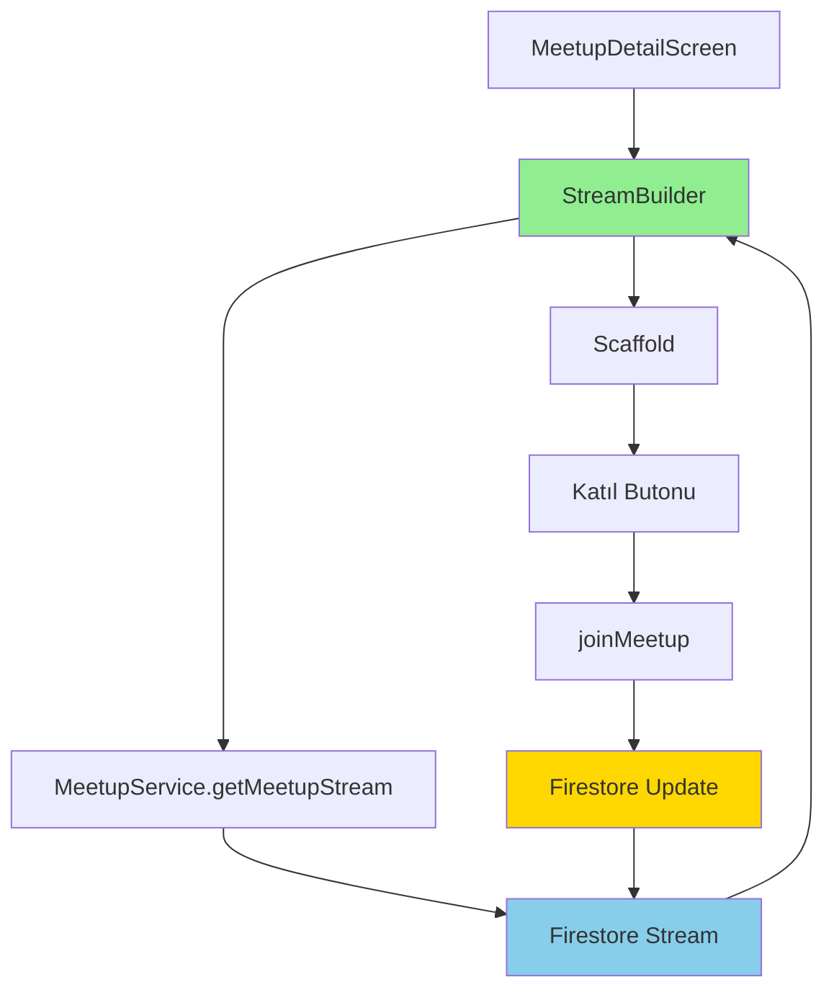
```mermaid
graph TD
    A[MeetupDetailScreen] --> B[StreamBuilder]
    B --> C[MeetupService.getMeetupStream]
    C --> D[Firestore Stream]
    
    B --> E[Scaffold]
    E --> F[Katıl Butonu]
    
    F --> G[joinMeetup]
    G --> H[Firestore Update]
    H --> D
    D --> B
    
    style B fill:#90EE90
    style D fill:#87CEEB
    style H fill:#FFD700
```

## 🔧 State Management

### MeetupCard State

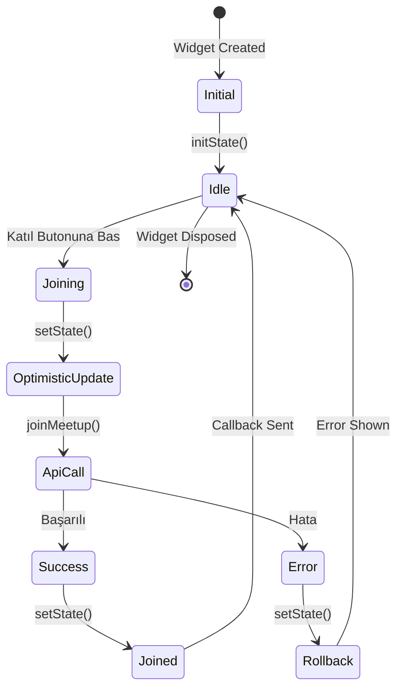
```mermaid
stateDiagram-v2
    [*] --> Initial: Widget Created
    Initial --> Idle: initState()
    
    Idle --> Joining: Katıl Butonuna Bas
    Joining --> OptimisticUpdate: setState()
    OptimisticUpdate --> ApiCall: joinMeetup()
    
    ApiCall --> Success: Başarılı
    ApiCall --> Error: Hata
    
    Success --> Joined: setState()
    Error --> Rollback: setState()
    
    Joined --> Idle: Callback Sent
    Rollback --> Idle: Error Shown
    
    Idle --> [*]: Widget Disposed
```

### StreamBuilder State

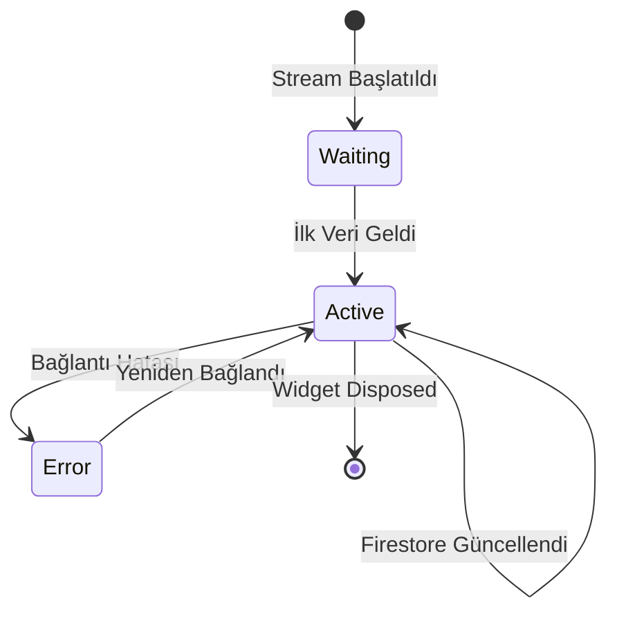
```mermaid
stateDiagram-v2
    [*] --> Waiting: Stream Başlatıldı
    Waiting --> Active: İlk Veri Geldi
    
    Active --> Active: Firestore Güncellendi
    Active --> Error: Bağlantı Hatası
    
    Error --> Active: Yeniden Bağlandı
    Active --> [*]: Widget Disposed
```

## 📊 Performans Karşılaştırması

### Firestore Okuma/Yazma Maliyeti

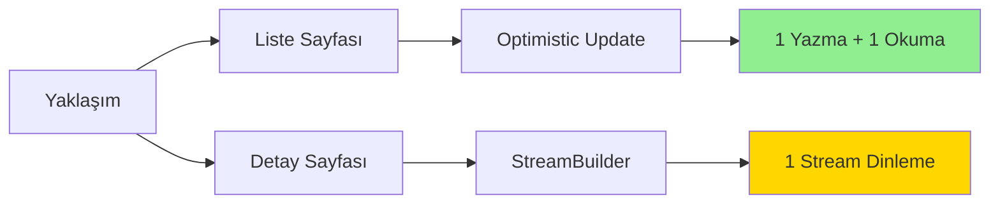
```mermaid
graph LR
    A[Yaklaşım] --> B[Liste Sayfası]
    A --> C[Detay Sayfası]
    
    B --> D[Optimistic Update]
    D --> E[1 Yazma + 1 Okuma]
    
    C --> F[StreamBuilder]
    F --> G[1 Stream Dinleme]
    
    style E fill:#90EE90
    style G fill:#FFD700
```

### Kullanıcı Deneyimi Süresi

```mermaid
gantt
    title UI Güncelleme Süresi
    dateFormat X
    axisFormat %L ms
    
    section Mevcut Durum
    Butona Bas           :0, 0
    Firestore Update     :0, 500
    UI Güncellenmez      :500, 1000
    
    section Yeni Durum
    Butona Bas           :0, 0
    Optimistic Update    :0, 50
    Firestore Update     :50, 550
    Veri Senkronize      :550, 600
```

## 🔐 Güvenlik Akışı

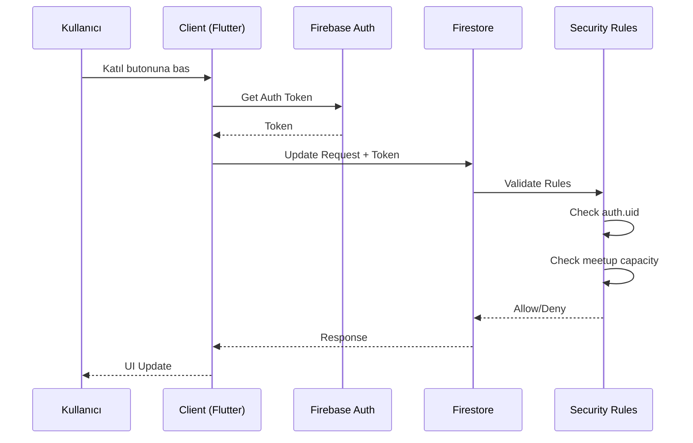
```mermaid
sequenceDiagram
    participant U as Kullanıcı
    participant C as Client (Flutter)
    participant A as Firebase Auth
    participant F as Firestore
    participant R as Security Rules
    
    U->>C: Katıl butonuna bas
    C->>A: Get Auth Token
    A-->>C: Token
    C->>F: Update Request + Token
    F->>R: Validate Rules
    R->>R: Check auth.uid
    R->>R: Check meetup capacity
    R-->>F: Allow/Deny
    F-->>C: Response
    C-->>U: UI Update
```

## 🧪 Test Akışı

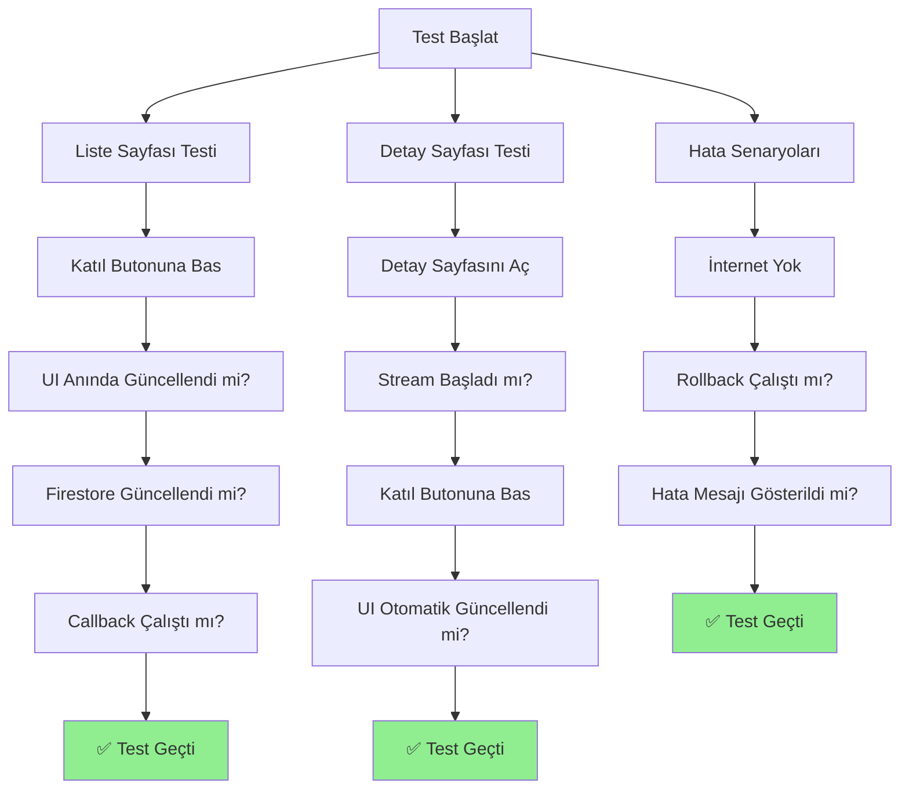
```mermaid
flowchart TD
    A[Test Başlat] --> B[Liste Sayfası Testi]
    A --> C[Detay Sayfası Testi]
    A --> D[Hata Senaryoları]
    
    B --> B1[Katıl Butonuna Bas]
    B1 --> B2[UI Anında Güncellendi mi?]
    B2 --> B3[Firestore Güncellendi mi?]
    B3 --> B4[Callback Çalıştı mı?]
    B4 --> B5[✅ Test Geçti]
    
    C --> C1[Detay Sayfasını Aç]
    C1 --> C2[Stream Başladı mı?]
    C2 --> C3[Katıl Butonuna Bas]
    C3 --> C4[UI Otomatik Güncellendi mi?]
    C4 --> C5[✅ Test Geçti]
    
    D --> D1[İnternet Yok]
    D1 --> D2[Rollback Çalıştı mı?]
    D2 --> D3[Hata Mesajı Gösterildi mi?]
    D3 --> D4[✅ Test Geçti]
    
    style B5 fill:#90EE90
    style C5 fill:#90EE90
    style D4 fill:#90EE90
```

## 📱 Çoklu Cihaz Senkronizasyonu

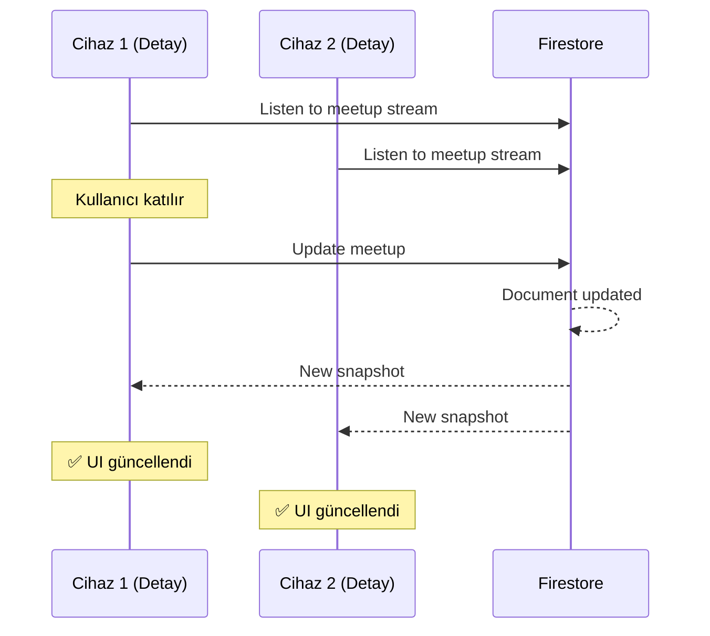
```mermaid
sequenceDiagram
    participant D1 as Cihaz 1 (Detay)
    participant D2 as Cihaz 2 (Detay)
    participant FS as Firestore
    
    D1->>FS: Listen to meetup stream
    D2->>FS: Listen to meetup stream
    
    Note over D1: Kullanıcı katılır
    D1->>FS: Update meetup
    FS-->>FS: Document updated
    
    FS-->>D1: New snapshot
    FS-->>D2: New snapshot
    
    Note over D1: ✅ UI güncellendi
    Note over D2: ✅ UI güncellendi
```

## 🎯 Optimizasyon Stratejisi

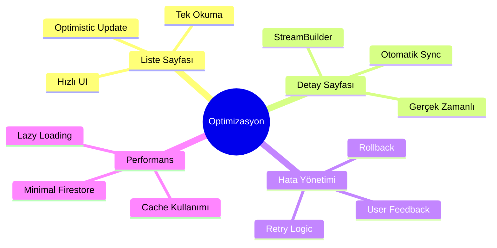
```mermaid
mindmap
  root((Optimizasyon))
    Liste Sayfası
      Optimistic Update
      Tek Okuma
      Hızlı UI
    Detay Sayfası
      StreamBuilder
      Gerçek Zamanlı
      Otomatik Sync
    Hata Yönetimi
      Rollback
      Retry Logic
      User Feedback
    Performans
      Minimal Firestore
      Cache Kullanımı
      Lazy Loading
```

## 🔄 Lifecycle Yönetimi

### MeetupCard Lifecycle

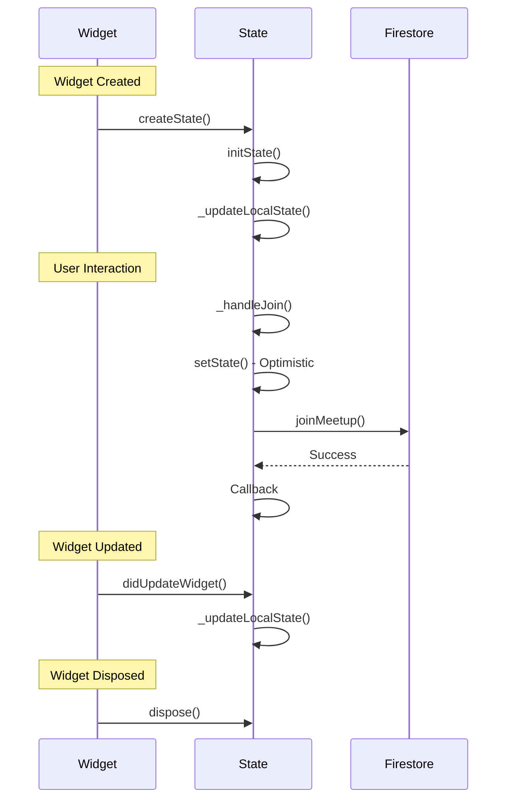
```mermaid
sequenceDiagram
    participant W as Widget
    participant S as State
    participant F as Firestore
    
    Note over W: Widget Created
    W->>S: createState()
    S->>S: initState()
    S->>S: _updateLocalState()
    
    Note over W: User Interaction
    S->>S: _handleJoin()
    S->>S: setState() - Optimistic
    S->>F: joinMeetup()
    F-->>S: Success
    S->>S: Callback
    
    Note over W: Widget Updated
    W->>S: didUpdateWidget()
    S->>S: _updateLocalState()
    
    Note over W: Widget Disposed
    W->>S: dispose()
```

### StreamBuilder Lifecycle

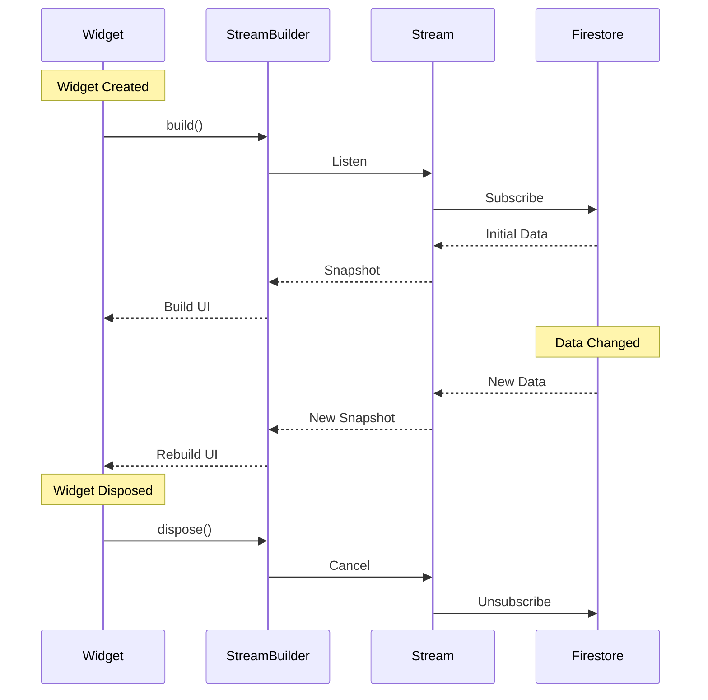
```mermaid
sequenceDiagram
    participant W as Widget
    participant SB as StreamBuilder
    participant S as Stream
    participant F as Firestore
    
    Note over W: Widget Created
    W->>SB: build()
    SB->>S: Listen
    S->>F: Subscribe
    
    F-->>S: Initial Data
    S-->>SB: Snapshot
    SB-->>W: Build UI
    
    Note over F: Data Changed
    F-->>S: New Data
    S-->>SB: New Snapshot
    SB-->>W: Rebuild UI
    
    Note over W: Widget Disposed
    W->>SB: dispose()
    SB->>S: Cancel
    S->>F: Unsubscribe
```

## 📈 Metrikler ve İzleme

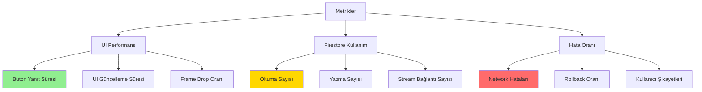
```mermaid
graph TD
    A[Metrikler] --> B[UI Performans]
    A --> C[Firestore Kullanım]
    A --> D[Hata Oranı]
    
    B --> B1[Buton Yanıt Süresi]
    B --> B2[UI Güncelleme Süresi]
    B --> B3[Frame Drop Oranı]
    
    C --> C1[Okuma Sayısı]
    C --> C2[Yazma Sayısı]
    C --> C3[Stream Bağlantı Sayısı]
    
    D --> D1[Network Hataları]
    D --> D2[Rollback Oranı]
    D --> D3[Kullanıcı Şikayetleri]
    
    style B1 fill:#90EE90
    style C1 fill:#FFD700
    style D1 fill:#FF6B6B
```
